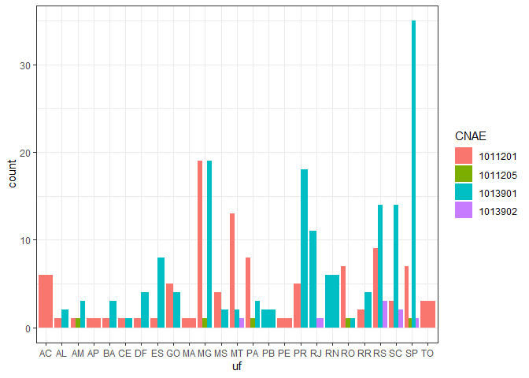

# **Introduction**

Dear colleague, below is the step-by-step for you to reproduce these
results

## **downloding the data**

the format of the Brazilian government’s query:
`http://compras.dados.gov.br/fornecedores/v1/fornecedores.{formato}?{parametro1=valor1}&{parametro2=valor2}&{parametroN=valorN}`,
you can change and add more parameters

``` r
suppliers_cnaes <- c('1011201','1011205','1013901','1013902') # you can changes this suppliers if you want

for(i in seq_along(suppliers_cnaes)){
  data_format <- 'csv' #other available formats are xml, json and html
  repeat{
    dw_try <- try(
      download.file(
        paste0('http://compras.dados.gov.br/fornecedores/v1/fornecedores.'
               ,data_format
               ,'?'
               ,'id_cnae='
               ,suppliers_cnaes[i]),
        paste0('data-raw/',suppliers_cnaes[i]))
    )
    if (!(inherits(dw_try,"try-error"))) 
      break
  }
  }
```

## **Processing and visualization**

``` r
file_names <- list.files('data-raw/')

for( i in seq_along(file_names)){
  if(i == 1){
    df <- read.csv(paste0('data-raw/',file_names[i]))
  }else{
    df_a <-  read.csv(paste0('data-raw/',file_names[i]))
    df <- rbind(df,df_a)
    rm(df_a)
  }
}


df |> 
  janitor::clean_names() |> 
  dplyr::mutate(
    municipio_cod = readr::parse_number(municipio),
    municipio_name = stringr::str_split(municipio,':',simplify = T)[,2],
    cnae_cod = readr::parse_number(cnae),
    cnae_name = stringr::str_split(cnae,':',simplify = T)[,2]
    ) |> 
  dplyr::select(
    id,cnpj,uf,municipio_cod,municipio_name,cnae_cod,cnae_name,nome
  ) |> 
  dplyr::group_by(uf,cnae_name) |> 
  ggplot2::ggplot(ggplot2::aes(x= uf))+
  ggplot2::geom_bar()+
  ggplot2::facet_wrap(~cnae_name, scales = 'free')
```

<!-- -->
